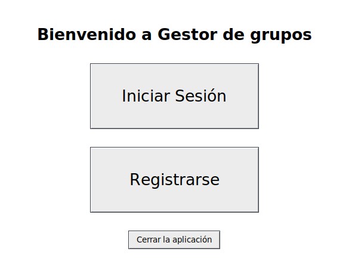
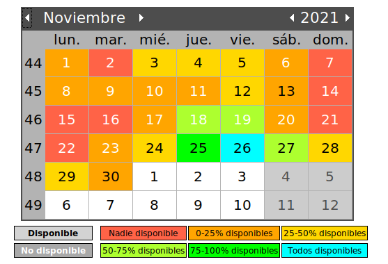
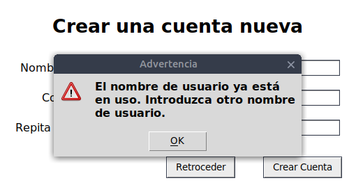
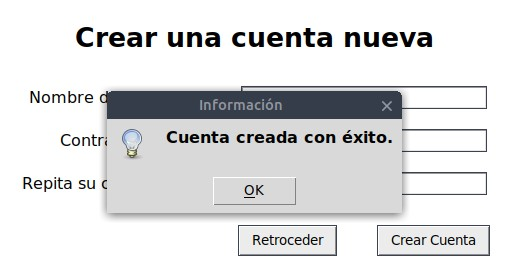
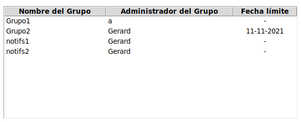

# Workgroup Manager Python Project

## Description
The Workgroup Manager is a Python application designed to address the needs of a university student who frequently collaborates on group projects. Coordinating schedules with a large number of group members can be challenging. This application allows each group member to input their availability for project work, and it displays a visual representation of all members' available days. This simplifies the process of determining the days with the most available group members for collaborative work.

## Key Features
- Cross-platform accessibility: The application can be used on various operating systems.
- User accounts: Users can create unique accounts with usernames and passwords to log in.
- Group creation: Users can create groups with unique names, passwords, and deadlines.
- Group administration: Group administrators can modify group properties, including the group administrator, password, and deadline.
- Group joining: Any user can join a group if they know the group's name and password.
- User invitations: Group administrators can invite users to join their groups.
- Availability input: Users can input their available days into the application.
- Visual availability display: The application visually represents the availability of all group members.
- Important change notifications: Users receive external notifications for significant group changes.
- Data integrity: User-entered data is accurately transmitted to the database, and vice versa.

## Development Overview

### Project Files Organization
The project is organized into three main files:
1. **gestor.py**: Contains the graphical user interface (GUI) and most of the program's logic.
2. **db.py**: Defines functions for executing SQL queries.
3. **clases.py**: Defines the User and Group classes with their attributes and functions.

### Tkinter Library
The GUI is created using the tkinter library, allowing the application to create screens, frames, buttons, labels, entries, and more. It provides flexibility in customizing GUI elements, such as changing background colors, fonts, and hover effects.

### Calendar Integration
A visual calendar is incorporated to display the availability of group members. Days change color based on member availability. The tkcalendar library is used for this purpose.

### Pop-Up Messages
The messagebox library from tkinter is used to display user-friendly messages, such as username availability when creating an account.

### Tables Display
To display group information, the Treeview library from tkinter is used. It helps create and display tables of group information.

### Updating Tables
Tables are updated automatically to reflect changes, such as when a new group is created.

### Database Mediator
A separate file, "db.py," is dedicated to database interaction. It defines a MySQL connector and functions to create, retrieve, and modify data in the database.

### Date Format Validation
A function is implemented to ensure that user-entered dates have the correct format.

## Evaluation

### Achievement of Criteria
1. **Cross-Platform Compatibility**: Achieved.
2. **User Account Creation**: Achieved, with username uniqueness verification.
3. **Group Creation**: Achieved, with required name, password, and deadline.
4. **Group Administration**: Achieved, limited to group administrators.
5. **Group Joining**: Achieved with the group name and password.
6. **User Invitations**: Achieved with notifications.
7. **Availability Input**: Achieved, allowing users to input their availability.
8. **Visual Availability Display**: Achieved, visually representing group member availability.
9. **External Notifications**: Partially achieved. Internal notifications are implemented, but external notifications can be explored in future development.
10. **Data Integrity**: Achieved. Data is accurately transmitted to and from the database.

### Recommendations for Future Development
1. **External Notifications**: Implement notifications outside the application, such as desktop notifications or automated emails, to keep users informed.
2. **Alternative Availability Input Method**: Explore alternative methods for users to input their availability to make the process less tedious.
3. **Visual Deadline Display**: Display group deadlines graphically on the calendar and restrict availability modifications after the deadline to maintain data integrity.
